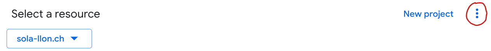

### Intro 
To use the Google Keep API, we will set up a service account that can impersonate a workspace user and request an access token with the three scopes needed to use the Keep API.

Google version of the above is
>  
> For authorization, you can use domain-wide delegation using a service account or an OAuth client ID. Domain-wide delegation with a service account is a powerful feature where the service account can impersonate any user in the domain without manual authorization on their part
> 

### Out of Scope

The following are pre​req​ui​sites and not covered here:  
* Creating a Google Workspace
* Creating a GCP project in that workspace
* Ensuring the project has the Keep APIs added to it. See [here](https://console.cloud.google.com/apis)

### Overview

Here are the quests we will undertake:  

1) [Create a service account](#step-1-create-a-service-account)

2) [Create a client id for the sa](#step-2-create-a-client-id-for-the-sa)

3) [Ensure the sa can impersonate workspace users](#step-3-ensure-sa-can-impersonate-users)

4) [Ensure we can create a key for the sa](#step-4-ensure-we-can-create-an-api-key-for-the-sa)

5) [Create a private key for the sa](#step-5-create-a-private-key-for-the-sa)

6) Using domain-wide delegation, [ensure the sa can request access tokens with the correct scopes](#step-6-ensure-the-sa-can-request-access-tokens-with-the-correct-scopes)

#### Step 1: Create a service account  
1. Log into the [Google Cloud Console](https://console.cloud.google.com/) as a workspace admin.  

2. Make sure you are in the correct project by noting what the project picker says  

3. In the left-hand nav, find `Service Account` and create the service account.

#### Step 2: Create a client id for the sa  
1. Click into the newly created service account.

2. Expand the "Advanced Settings" section. It is collapsed by default.

3. Create a "Marketplace compatible OAuth Client" for the sa. The button shoud look like  

Let's verify that we have created the OAuth client for the sa

1. In the [Google Cloud Console](https://console.cloud.com), use the left-hand nav to navigate to `APIs & Services`

2. Navigate to `Credentials`  
You should see the sa and an OAuth2 client for the sa

#### Step 3: Ensure sa can impersonate users  
1. In [Google Cloud Console](https://console.cloud.com), use the left hand nav to navigate to `IAM`

2. Find the sa in the list of principals, and click the edit button

3. Add the following role: `Service Account Token Creator` 

Let's verify...

1. In the left-hand nav, navigate to `Policy Analyzer`

2. Run a custom query where you ask what principal(s) have the `Service Account Token Creator` role. You should see the sa principal.

#### Step 4: Ensure we can create an api key for the sa  
By default (at least in my workspace), a policy is in effect to prevent creating private keys for system accounts. Testing to see if the policy is in effect is easy; try to create a JSON key for your sa. 

**Note**, This policy is in effect even for workspace super admins! 

1. Log into [Google Cloud Console](https://console.cloud.com) as a workspace admin or super admin.

2. Click the project picker (see above for image)

3. Click on the kebab icon for more actions

4. Add the following 2 Roles
* Organization Policy Administrator
* Organization Administrator

Our admin can now disable the policy that is in effect preventing us from creating keys for our sa.

5. In the Google Cloud Console, navigate to `Organization Policies`

6. Find and disable a policy called `Disable service account key creation`

Credit where credit is due. This stumped me. Were it not for Zalamit's summary in [this reddit thread](https://www.reddit.com/r/googleworkspace/comments/1biw03d/service_account_key_creation_is_disabled/), I probably would have given up.

#### Step 5: Create a private key for the sa  
1. In [Google Cloud Console](https://console.cloud.com), use the left nav to `Service Accounts`

2. Find the sa, select it, and create a JSON key. If Google prevents it, then Step 4 is incomplete and I'll need to update it.

3. The downloaded key will be used by our cli scripts.

#### Step 6: ensure the sa can request access tokens with the correct scopes  
1. Log into the [Workspace Admin Console](https://admin.google.com/)

2. Select `Security`

3. Select `Access and Data Control`

4. Select `API Controls`

5. Click the "Manage Domain Wide Delegation" button

6. Add the client id for the sa

7. Ensure we add the scopes needed by Keep:
> https://www.googleapis.com/auth/keep
> https://www.googleapis.com/auth/keep.readonly
> https://www.googleapis.com/auth/userinfo.email

This shouldn't affect anything